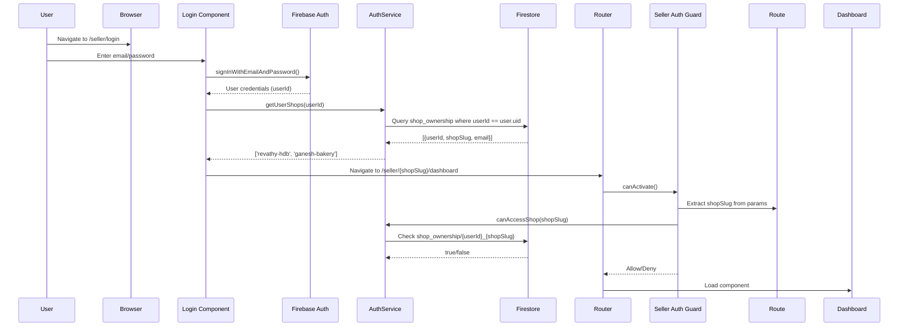

# 🏗️ Architecture Documentation - WhatsApp Ordering PWA

## 📋 Table of Contents
1. [System Overview](#system-overview)
2. [Routing Architecture](#routing-architecture)
3. [Authentication Flow](#authentication-flow)
4. [Database Structure](#database-structure)
5. [Service Architecture](#service-architecture)
6. [Security Model](#security-model)

---

## 🎯 System Overview

### Technology Stack

**Frontend:**
- Angular 17+ (Standalone Components)
- Angular Material UI
- RxJS for reactive programming
- TypeScript

**Backend:**
- Firebase Authentication
- Cloud Firestore (NoSQL database)
- Firebase Storage (images)
- Firebase Hosting

**Integrations:**
- Razorpay Payment Gateway
- WhatsApp Business API (Click-to-Chat)

**PWA Features:**
- Service Worker (offline support)
- Web App Manifest
- Push Notifications (future)

---

## 🗺️ Routing Architecture

### Route Structure

The application has **3 distinct route hierarchies**:

#### 1. **Customer Routes** (Public)
```
/:shopSlug/home              → Shop homepage
/:shopSlug/products          → Product catalog
/:shopSlug/product/:id       → Product details
/:shopSlug/cart              → Shopping cart
```

**Example:** `http://localhost:4200/revathy-hdb/home`

**Characteristics:**
- ✅ No authentication required
- ✅ Shop slug in URL determines which shop
- ✅ Multi-tenant (multiple shops on same domain)

#### 2. **Seller Routes** (Protected)
```
/seller/login                        → Seller login (NO shop slug)
/seller/:shopSlug/dashboard          → Seller dashboard
/seller/:shopSlug/products           → Product management
/seller/:shopSlug/orders             → Order management
```

**Example:** `http://localhost:4200/seller/revathy-hdb/dashboard`

**Characteristics:**
- ✅ Authentication required (`sellerAuthGuard`)
- ✅ Shop slug determined AFTER login from database
- ✅ Shop ownership verified via Firestore

#### 3. **Admin Routes** (Protected)
```
/admin/login                 → Admin login
/admin/sellers               → Manage sellers
/admin/shops                 → Manage shops
```

**Example:** `http://localhost:4200/admin/login`

**Characteristics:**
- ✅ Admin authentication required (`adminAuthGuard`)
- ✅ Super admin access only

---

## 🔐 Authentication Flow

### Seller Authentication (Login → Dashboard)



### Key Implementation Details

**1. Login Component** (`seller-login.component.ts`):
```typescript
async login() {
  // 1. Authenticate with Firebase
  const credential = await signInWithEmailAndPassword(auth, email, password);
  
  // 2. Get user's shops from database
  const userShops = await this.authService.getUserShops();
  
  // 3. Handle no shops case
  if (userShops.length === 0) {
    this.errorMessage = 'You have no shops assigned';
    await this.auth.signOut();
    return;
  }
  
  // 4. Redirect to first shop's dashboard
  const shopSlug = userShops[0];
  this.router.navigateByUrl(`/seller/${shopSlug}/dashboard`);
}
```

**2. Seller Auth Guard** (`seller-auth.guard.ts`):
```typescript
export const sellerAuthGuard: CanActivateFn = (route, state) => {
  const authService = inject(AuthService);
  const router = inject(Router);
  
  // 1. Check if user is authenticated
  return authService.user$.pipe(
    take(1),
    switchMap(user => {
      if (!user) {
        router.navigate(['/seller/login']);
        return of(false);
      }
      
      // 2. Extract shop slug from route params
      const shopSlug = route.paramMap.get('shopSlug') || '';
      
      if (!shopSlug) {
        router.navigate(['/seller/login']);
        return of(false);
      }
      
      // 3. Verify user owns this shop
      return from(authService.canAccessShop(shopSlug)).pipe(
        map(hasAccess => {
          if (!hasAccess) {
            router.navigate(['/unauthorized']);
            return false;
          }
          return true;
        })
      );
    })
  );
};
```

**3. Auth Service** (`auth.service.ts`):
```typescript
async getUserShops(): Promise<string[]> {
  const user = this.auth.currentUser;
  if (!user) return [];
  
  // Query shop_ownership collection
  const q = query(
    collection(this.firestore, 'shop_ownership'),
    where('userId', '==', user.uid),
    where('status', '==', 'active')
  );
  
  const snapshot = await getDocs(q);
  return snapshot.docs.map(doc => doc.data().shopSlug);
}

async canAccessShop(shopSlug: string): Promise<boolean> {
  const user = this.auth.currentUser;
  if (!user) return false;
  
  // Check ownership document exists
  const docId = `${user.uid}_${shopSlug}`;
  const docRef = doc(this.firestore, 'shop_ownership', docId);
  const docSnap = await getDoc(docRef);
  
  return docSnap.exists() && docSnap.data()?.status === 'active';
}
```

---

## 🗄️ Database Structure

### Firestore Collections

#### 1. **shops** Collection
Stores shop information (public data)

```typescript
{
  id: 'shop-revathy-001',           // Auto-generated document ID
  slug: 'revathy-hdb',              // URL-friendly identifier (UNIQUE)
  name: 'Revathy HDB Store',        // Display name
  phoneE164: '918220762702',        // WhatsApp number
  address: '123 Main St, Chennai',  // Physical address
  isActive: true,                   // Shop status
  theme: {
    primaryColor: '#1976d2',
    accentColor: '#ff4081',
    logo: 'https://...'
  },
  createdAt: Timestamp,
  updatedAt: Timestamp
}
```

**Key Fields:**
- `slug` → Used in customer URLs (/:shopSlug/home)
- `phoneE164` → WhatsApp integration
- `isActive` → Controls shop visibility

#### 2. **shop_ownership** Collection
Links users to shops they own/manage

```typescript
{
  id: 'abc123uid_revathy-hdb',      // Document ID: {userId}_{shopSlug}
  userId: 'abc123uid...',           // Firebase Auth UID
  email: 'seller@revathy.com',      // Owner email
  shopSlug: 'revathy-hdb',          // Must match shops.slug
  shopName: 'Revathy HDB Store',    // For display
  role: 'owner',                    // owner | manager | staff
  status: 'active',                 // active | suspended
  createdAt: Timestamp
}
```

**Key Design Decisions:**
- ✅ Document ID is deterministic: `{userId}_{shopSlug}`
- ✅ Enables fast ownership lookups
- ✅ One document per user-shop relationship
- ✅ Supports multi-shop ownership (one user, multiple documents)

#### 3. **products** Collection
Product catalog

```typescript
{
  id: 'product-001',                // Auto-generated
  shopId: 'shop-revathy-001',       // Reference to shops collection
  shopSlug: 'revathy-hdb',          // Denormalized for queries
  name: 'Fresh Milk 1L',
  description: 'Farm fresh dairy milk',
  price: 60,                        // In rupees
  category: 'Dairy',
  imageUrl: 'https://...',
  stock: 100,                       // Available quantity
  isAvailable: true,                // In stock flag
  createdAt: Timestamp,
  updatedAt: Timestamp
}
```

#### 4. **orders** Collection
Customer orders

```typescript
{
  id: 'order-001',                  // Auto-generated
  shopId: 'shop-revathy-001',
  shopSlug: 'revathy-hdb',
  customerId: 'customer-uid',       // Optional (guest checkout)
  customerName: 'John Doe',
  customerPhone: '919876543210',
  items: [
    {
      productId: 'product-001',
      productName: 'Fresh Milk 1L',
      quantity: 2,
      price: 60,
      subtotal: 120
    }
  ],
  totalAmount: 120,
  status: 'pending',                // pending | confirmed | delivered | cancelled
  paymentStatus: 'pending',         // pending | paid | failed
  paymentMethod: 'razorpay',        // razorpay | cod
  razorpayOrderId: 'order_xyz',     // If paid via Razorpay
  createdAt: Timestamp,
  updatedAt: Timestamp
}
```

#### 5. **admin** Collection
Admin users

```typescript
{
  id: 'admin@shop.com',             // Email as document ID
  email: 'admin@shop.com',
  role: 'super_admin',              // super_admin | admin
  status: 'active',
  createdAt: Timestamp
}
```

---

## 🔧 Service Architecture

### Core Services

#### 1. **AuthService** (`auth.service.ts`)
Handles authentication and authorization

**Key Methods:**
```typescript
class AuthService {
  user$: Observable<User | null>;            // Current user stream
  
  async getUserShops(): Promise<string[]>;   // Get user's shop slugs
  async canAccessShop(shopSlug: string): Promise<boolean>; // Verify ownership
  async createShopOwnership(data): Promise<void>; // Admin creates seller
  async isAdmin(): Promise<boolean>;         // Check admin status
}
```

#### 2. **ShopService** (`shop.service.ts`)
Manages current shop context

**Key Methods:**
```typescript
class ShopService {
  currentShop$: BehaviorSubject<Shop | null>; // Current shop stream
  
  async initializeShop(shopSlug: string): Promise<void>; // Load shop by slug
  async updateShop(shop: Shop): Promise<void>; // Update shop details
  isSellerRoute(): boolean; // Check if current route is seller route
}
```

**Performance Optimization:**
```typescript
// Prevent duplicate Firebase calls
private loadingShopSlug: string | null = null;

async initializeShop(shopSlug: string): Promise<void> {
  // Skip if already loading this shop
  if (this.loadingShopSlug === shopSlug) return;
  
  // Skip loading for seller routes (they don't need shop context)
  if (this.isSellerRoute()) return;
  
  this.loadingShopSlug = shopSlug;
  
  try {
    const shop = await this.firebaseService.getShopBySlug(shopSlug);
    this.currentShop$.next(shop);
  } finally {
    this.loadingShopSlug = null;
  }
}
```

#### 3. **FirebaseService** (`firebase.service.ts`)
Firestore data access layer

**Key Methods:**
```typescript
class FirebaseService {
  async getShopBySlug(slug: string): Promise<Shop | null>;
  async getShopById(id: string): Promise<Shop | null>;
  async getProducts(shopSlug: string): Promise<Product[]>;
  async createOrder(order: Order): Promise<string>;
}
```

**Example Implementation:**
```typescript
async getShopBySlug(slug: string): Promise<Shop | null> {
  if (!this.firestore) return null;
  
  try {
    // Query shops collection by slug field
    const q = query(
      collection(this.firestore, 'shops'),
      where('slug', '==', slug),
      where('isActive', '==', true),
      limit(1)
    );
    
    const snapshot = await getDocs(q);
    
    if (snapshot.empty) return null;
    
    const doc = snapshot.docs[0];
    return { id: doc.id, ...doc.data() } as Shop;
  } catch (error) {
    console.error('Error fetching shop:', error);
    return null;
  }
}
```

#### 4. **WhatsAppService** (`whatsapp.service.ts`)
WhatsApp integration

**Key Methods:**
```typescript
class WhatsAppService {
  sendOrder(order: Order, shop: Shop): void {
    const message = this.formatOrderMessage(order);
    const phoneNumber = shop.phoneE164;
    const url = `https://wa.me/${phoneNumber}?text=${encodeURIComponent(message)}`;
    window.open(url, '_blank');
  }
  
  private formatOrderMessage(order: Order): string {
    return `
*New Order* 🛒

*Customer:* ${order.customerName}
*Phone:* ${order.customerPhone}

*Items:*
${order.items.map(item => 
  `• ${item.productName} x${item.quantity} = ₹${item.subtotal}`
).join('\n')}

*Total:* ₹${order.totalAmount}
    `.trim();
  }
}
```

#### 5. **RazorpayService** (`razorpay.service.ts`)
Payment processing

**Key Methods:**
```typescript
class RazorpayService {
  async createOrder(amount: number): Promise<any>;
  async openCheckout(options: any): Promise<any>;
  async verifyPayment(paymentId: string): Promise<boolean>;
}
```

---

## 🔒 Security Model

### Firestore Security Rules

```javascript
rules_version = '2';
service cloud.firestore {
  match /databases/{database}/documents {
    
    // Helper functions
    function isAuthenticated() {
      return request.auth != null;
    }
    
    function isAdmin() {
      return isAuthenticated() && 
        exists(/databases/$(database)/documents/admin/$(request.auth.token.email));
    }
    
    function isShopOwner(shopSlug) {
      return isAuthenticated() && 
        exists(/databases/$(database)/documents/shop_ownership/$(request.auth.uid + '_' + shopSlug));
    }
    
    // Admin collection - read only for admins
    match /admin/{adminId} {
      allow read: if isAdmin();
      allow write: if false; // Only via Firebase Console
    }
    
    // Shops - public read, owner/admin write
    match /shops/{shopId} {
      allow read: if true;
      allow write: if isAdmin() || isShopOwner(resource.data.slug);
    }
    
    // Shop ownership - authenticated read, admin write
    match /shop_ownership/{ownershipId} {
      allow read: if isAuthenticated();
      allow write: if isAdmin();
    }
    
    // Products - public read, owner/admin write
    match /products/{productId} {
      allow read: if true;
      allow write: if isAdmin() || isShopOwner(resource.data.shopSlug);
    }
    
    // Orders - anyone can create, owner/admin can update
    match /orders/{orderId} {
      allow read: if isAuthenticated();
      allow create: if true; // Guest checkout
      allow update: if isAdmin() || isShopOwner(resource.data.shopSlug);
      allow delete: if isAdmin();
    }
  }
}
```

### Security Best Practices

1. **Environment Variables**
   - ✅ API keys in `environment.ts` (git-ignored)
   - ✅ Never commit credentials
   - ✅ Use Firebase Remote Config for sensitive data

2. **Authentication**
   - ✅ Firebase Auth for identity management
   - ✅ Route guards on all protected routes
   - ✅ JWT tokens for API calls

3. **Authorization**
   - ✅ Firestore rules verify ownership
   - ✅ Guards check database for permissions
   - ✅ Admin actions require admin role

4. **Data Validation**
   - ✅ Client-side validation (Angular forms)
   - ✅ Server-side validation (Firestore rules)
   - ✅ Type safety (TypeScript)

---

## 📊 Data Flow Diagrams

### Product Browsing Flow
```
Customer → /:shopSlug/products
         → ShopService.initializeShop(shopSlug)
         → FirebaseService.getShopBySlug(shopSlug)
         → Firestore (shops collection)
         → FirebaseService.getProducts(shopSlug)
         → Firestore (products collection)
         → ProductsComponent.products$
         → UI renders product list
```

### Order Creation Flow
```
Customer → Add items to cart (CartService)
         → Click "Order via WhatsApp"
         → CartService.createOrder()
         → FirebaseService.createOrder(order)
         → Firestore (orders collection)
         → WhatsAppService.sendOrder(order, shop)
         → Opens WhatsApp with formatted message
```

---

## 🎯 Design Decisions

### Why Deterministic Document IDs?

**shop_ownership** uses `{userId}_{shopSlug}` pattern:

**✅ Benefits:**
- Fast lookups without querying
- No duplicate ownership records
- Easy to construct ID on client and server
- Compound key ensures uniqueness

**Example:**
```typescript
// Client-side check
const docId = `${currentUser.uid}_revathy-hdb`;
const docRef = doc(firestore, 'shop_ownership', docId);
const docSnap = await getDoc(docRef); // Fast document read

// vs. Query (slower)
const q = query(
  collection(firestore, 'shop_ownership'),
  where('userId', '==', currentUser.uid),
  where('shopSlug', '==', 'revathy-hdb')
);
const snapshot = await getDocs(q); // Requires index, slower
```

### Why Shop Slug in URL for Customers?

**Benefits of `/:shopSlug/home` pattern:**
- ✅ Multi-tenant architecture (one codebase, many shops)
- ✅ SEO-friendly URLs
- ✅ Clear shop context from URL
- ✅ Easy to share shop links
- ✅ Browser bookmarks work per shop

---

## 📚 Additional Documentation

- [Setup Guide](./SETUP-GUIDE.md) - Development setup
- [Deployment Guide](./DEPLOYMENT.md) - Production deployment
- [Troubleshooting](./TROUBLESHOOTING.md) - Common issues

---

**Last Updated:** February 2026
